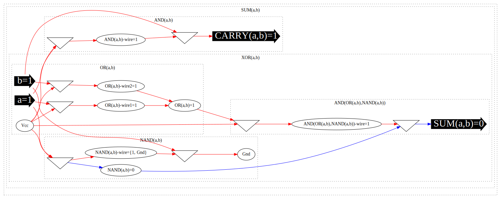
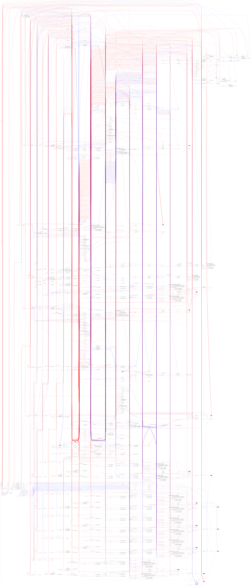

# circuit-engine

Define and simulate circuits from transistors all the way to an 8-bit computer.

## Example Component

### Define

```go
// HalfSum adds a half adder.
func HalfSum(parent *group.Group, a, b *wire.Wire) []*wire.Wire {
	group := parent.Group(sfmt.Sprintf("S(%s,%s)", a.Name, b.Name))
	res := gate.Xor(group, a, b)
	res.Name = group.Name
	carry := gate.And(group, a, b)
	carry.Name = sfmt.Sprintf("C(%s,%s)", a.Name, b.Name)
	return []*wire.Wire{res, carry}
}
```

### Create

```go
    "HalfSum": func(c *circuit.Circuit) []*wire.Wire {
        return sum.HalfSum(c.Group(""), c.In("a"), c.In("b"))
    },
```

### Unit Test

```go
    name: "HalfSum",
    isValidInt: func(inputs map[string]int) []int {
        sum := inputs["a"] + inputs["b"]
        return []int{sum % 2, sum / 2}
    },
```

```
a b => S(a,b) C(a,b)

a(0) b(0) => S(a,b)(0) C(a,b)(0)
a(0) b(1) => S(a,b)(1) C(a,b)(0)
a(1) b(0) => S(a,b)(1) C(a,b)(0)
a(1) b(1) => S(a,b)(0) C(a,b)(1)
```

### Draw

```console
$ go run main.go --example_name HalfSum --draw_graph --draw_single_graph | dot -Tsvg > doc/HalfSum.svg
$ google-chrome doc/HalfSum.svg
```



### Print

```console
$ go run main.go --example_name HalfSum
```

```console
Inputs:   a=0  b=1
Outputs:
  S(a,b)=1
  C(a,b)=0
Components:

----------
|S(a,b)
|----------
||XOR(a,b)
||----------
|||OR(a,b)
|||----------
||||a=0    Vcc    OR(a,b)-wire1=0
||||b=1    Vcc    OR(a,b)-wire2=1
||||OR OR(a,b)-wire1=0    OR(a,b)-wire2=1    OR(a,b)=1
|||----------
|||NAND(a,b)
|||----------
||||a=0    Vcc    NAND(a,b)-wire=0    NAND(a,b)=1
||||b=1    NAND(a,b)-wire=0    Gnd
|||----------
|||AND(OR(a,b),NAND(a,b))
|||----------
||||OR(a,b)=1    Vcc    AND(OR(a,b),NAND(a,b))-wire=1
||||NAND(a,b)=1    AND(OR(a,b),NAND(a,b))-wire=1    S(a,b)=1
|||----------
||----------
||AND(a,b)
||----------
|||a=0    Vcc    AND(a,b)-wire=0
|||b=1    AND(a,b)-wire=0    C(a,b)=0
||----------
|----------
----------
```

## Other Features

### Draw Multiple Graphs

```console
$ go run main.go --example_name HalfSum --draw_graph
$ for file in *.dot; do dot -Tsvg "${file}" > "${file}".svg; done
$ google-chrome *.svg
```

## Example Circuits

See [lib/lib.go](lib/lib.go).

### Unit Tests For Example Circuits

See [lib/lib_test.go](lib/lib_test.go) and [lib/testdata](lib/testdata).

## 2-bit CPU with 2-bit RAM (4 words)

```go
// WithCPU adds an arithmetic logic unit with CPU.
func WithCPU(parent *group.Group, e *wire.Wire, n int) []*wire.Wire {
	group := parent.Group("CPU")

	// step counter for microcode
	s := latch.CounterN(group, e, n)

	// current step
	sel := decode.Decode(group, s)
	for i := range sel {
		sel[i] = gate.And(group, sel[i], gate.Not(group, e))
	}

	// step 0: program counter out (co), memory address in (mi)
	co := gate.Or(group, sel[0], group.False())
	co.Name = "co"
	mi := gate.Or(group, sel[0], sel[2])
	mi.Name = "mi"

	// step 1: ram out (ro), instruction register in (ii), program counter increment (ce)
	ro := gate.Or(group, sel[1], sel[3])
	ro.Name = "ro"
	ii := gate.Or(group, sel[1], group.False())
	ii.Name = "ii"
	ce := gate.Or(group, sel[1], group.False())
	ce.Name = "ce"

	// step 2: program counter in (ci), instruction out (io)
	ci := gate.Or(group, sel[2], group.False())
	ci.Name = "ci"
	io := gate.Or(group, sel[2], group.False())
	io.Name = "io"

	// step 3: a register in (ai), ram memory out (ro, above)
	ai := gate.Or(group, sel[3], group.False())
	ai.Name = "ai"

	// b register in
	bi := &wire.Wire{Name: "bi"}
	// ram in
	ri := &wire.Wire{Name: "ri"}
	// total register in
	ti := &wire.Wire{Name: "ti"}
	// total register out
	to := &wire.Wire{Name: "to"}

	var a, b, d, i, m, r []*wire.Wire
	for bit := 0; bit < n; bit++ {
		// a register
		a = append(a, &wire.Wire{Name: "a"})
		// b register
		b = append(b, &wire.Wire{Name: "b"})
		// bus data
		d = append(d, &wire.Wire{Name: "d"})
		// instruction register
		i = append(i, &wire.Wire{Name: "i"})
		// memory address register
		m = append(m, &wire.Wire{Name: "m"})
		// ram output
		r = append(r, &wire.Wire{Name: "r"})
	}

	// a register
	ar := reg.N(group, a, ai, group.True())
	// b register
	br := reg.N(group, b, bi, group.True())
	// total
	t := sum.N(group, ar, br, group.False())
	// carry out
	last := len(t) - 1
	t[last].Name = sfmt.Sprintf("C(%s,%s)", a[last-1].Name, b[last-1].Name)
	// total register
	tr := reg.N(group, t[:last], ti, to)
	for i, ai := range a {
		tr[i].Name = sfmt.Sprintf("RS%s%s", ai.Name, b[i].Name)
	}

	// program counter register
	cr := reg.N(group, latch.CounterN(group, ce, n), ci, co)
	// instruction register
	ir := reg.N(group, i, ii, io)
	// memory address register
	mr := reg.N(group, m, mi, group.True())
	// ram output
	rr := ram.RAM(group, mr, r, ri, ro)
	// bus data
	dr := bus.BnIOn(group, append([][]*wire.Wire{d, cr, ir}, rr...), [][]*wire.Wire{a, b, i, m, r})

	return slices.Concat(ar, br, cr, dr, s, tr, ir, mr, slices.Concat(rr...))
}
```

```
e => Ra Ra Rb Rb Rce0 Rce1 Bd Bd e0 e1 RSab RSab Ri Ri Rm Rm Rr00 Rr01 Rr10 Rr11 Rr20 Rr21 Rr30 Rr31

e(0) => Ra(1) Ra(1) Rb(1) Rb(1) Rce0(0) Rce1(0) Bd(1) Bd(1) e0(1) e1(1) RSab(0) RSab(0) Ri(0) Ri(0) Rm(1) Rm(1) Rr00(0) Rr01(0) Rr10(0) Rr11(0) Rr20(0) Rr21(0) Rr30(1) Rr31(1)
e(1) => Ra(1) Ra(1) Rb(1) Rb(1) Rce0(0) Rce1(0) Bd(0) Bd(0) e0(1) e1(1) RSab(0) RSab(0) Ri(0) Ri(0) Rm(1) Rm(1) Rr00(0) Rr01(0) Rr10(0) Rr11(0) Rr20(0) Rr21(0) Rr30(0) Rr31(0)
e(0) => Ra(1) Ra(1) Rb(1) Rb(1) Rce0(1) Rce1(1) Bd(1) Bd(1) e0(0) e1(0) RSab(0) RSab(0) Ri(0) Ri(0) Rm(1) Rm(1) Rr00(0) Rr01(0) Rr10(0) Rr11(0) Rr20(0) Rr21(0) Rr30(0) Rr31(0)

// program counter = 11 = 3 = memory address register

// ...

e(0) => Ra(1) Ra(1) Rb(1) Rb(1) Rce0(0) Rce1(0) Bd(0) Bd(0) e0(0) e1(0) RSab(0) RSab(0) Ri(0) Ri(0) Rm(0) Rm(0) Rr00(0) Rr01(0) Rr10(0) Rr11(0) Rr20(0) Rr21(0) Rr30(0) Rr31(0)

// program counter = 00 = 0 = memory address register

// ...

e(0) => Ra(1) Ra(1) Rb(1) Rb(1) Rce0(1) Rce1(0) Bd(1) Bd(0) e0(0) e1(0) RSab(0) RSab(0) Ri(0) Ri(0) Rm(1) Rm(0) Rr00(0) Rr01(0) Rr10(0) Rr11(0) Rr20(0) Rr21(0) Rr30(0) Rr31(0)


// program counter = 00 = 0 = memory address register

// ...
```



## Other

Inspired by Ben Eater's [Building an 8-bit breadboard computer!](https://www.youtube.com/watch?v=g_1HyxBzjl0&list=PLowKtXNTBypGqImE405J2565dvjafglHU&index=28).
